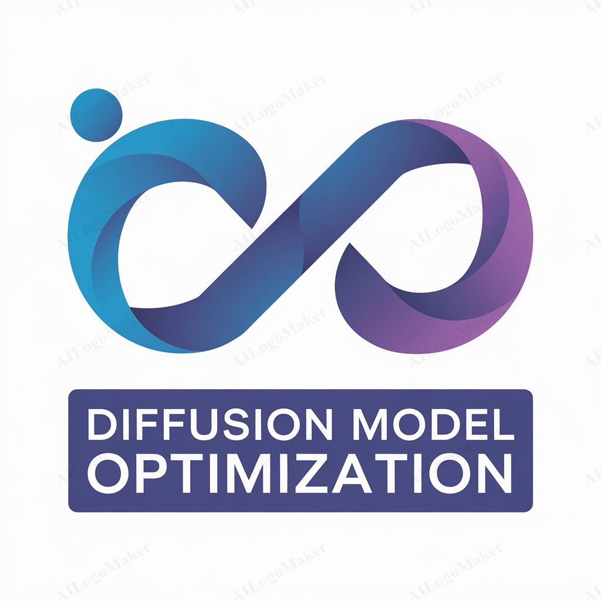

# Diffusion-Model-Optimization

     
    

## Module 1. Quantization Model: Unet & Transformer
### 1.1. Quantization Aware Training
### 1.2. Post Training Quantization
### 1.3. Quantization granularity
### 1.4. Quantization range
### 1.5. Asymmetric and symmetric quantization

## Module 2. Key-Value Cache (Decode & Greedy) - Auto regressive+Bidirectional Attention
## Module 3. Distillation Model: Distill GPT, Tiny LLaMa
### 3.1 Num-Inference-steps
### 3.2 Num-Image-per-prompt
## Module 4. Flash Attention
## Module 5. PEFT(Parameter-Efficient-Fine-Tuning)/LoRA
## Module 6. Early Exit
